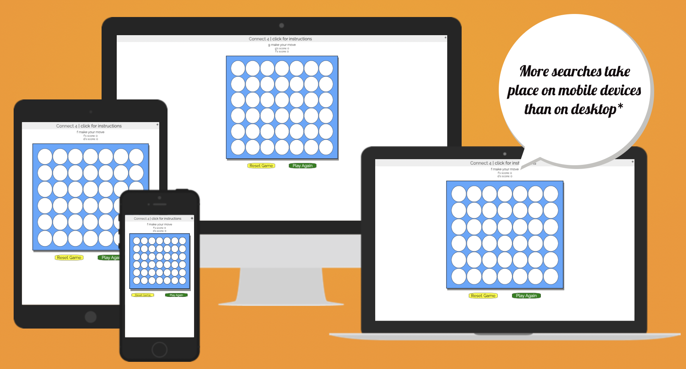

# PORTFOLIO 2 - "Connect 4"

Connect 4 is an online game where users can input their own username and play a game of connect 4 with a friend. The game recognises the winner and alerts the users of the winner or if there was a draw. The game keeps score of how many games each user has one, the users can then choose to play again and have a tournament or they can reset the game, re-enter their usernames and return the scores to zero.

The site has a large target audience as connect 4 is a simple to understand game suited to all age groups. The game is easy to use with clear instructions, and clear labels on all buttons.

Below you can see the site on different screen sizes. Taken from [Am I responsive](https://amiresponsive.co.uk/).

The live site can be found [here](https://8000-sacarr98-project2-gmjtabf2494.ws-eu110.gitpod.io/)

---

## CONTENTS

- [PORTFOLIO 2 - "Connect 4"](#portfolio-2---connect-4)
  - [CONTENTS](#contents)
  - [User Experience (UX)](#user-experience-ux)
    - [User Stories](#user-stories)
      - [First Time Visitor Goals](#first-time-visitor-goals)
  - [Design](#design)
    - [Colour Scheme](#colour-scheme)
    - [Typography](#typography)
    - [Imagery](#imagery)
    - [Wireframes](#wireframes)
  - [Features](#features)
    - [General features on each page](#general-features-on-each-page)
    - [Future Implementations](#future-implementations)
    - [Accessibility](#accessibility)
  - [Technologies Used](#technologies-used)
    - [Languages Used](#languages-used)
    - [Frameworks, Libraries \& Programs Used](#frameworks-libraries--programs-used)
  - [Deployment \& Local Development](#deployment--local-development)
    - [Deployment](#deployment)
    - [Local Development](#local-development)
      - [How to Fork](#how-to-fork)
      - [How to Clone](#how-to-clone)
  - [Testing](#testing)
  - [Credits](#credits)
    - [Code Used](#code-used)
    - [Content](#content)
    - [ Media](#media)
    - [ Acknowledgments](#acknowledgments)

---

## User Experience (UX)

### User Stories

#### First Time Visitor Goals

- To be able to compete against their friends
- To be able to play multiple games in a tournament
- To be able to easily follow the rules and navigate the game

## Design

### Colour Scheme

We wanted to have a colour scheme that was not too bright as users may spend an extended period of time on the site and bright colours can lead to sight fatigue. We wanted the colour scheme of the game to match that of the physical game that users can purchase.

### Typography

Raleway font was used from google fonts as we thought this looked fun while still being easy to read. Sans-serif was used as a back-up font.

### Imagery

There is no imagery used on the site itself. The game image is created using CSS styling and Javacsript.

### Wireframes

## Features

The website is comprised of one game page. This game features the instructions in a drop down menu so as not to distract from the players view. The player names are also clearly displayed above the game as well as their scores against eachother. The connect 4 game takes up the majority of the page making for easy navigation. The play again and restart buttons are clearly visible and brightly coloured below the game section so they cannot be missed.

### General features on each page
Before the game begins the users are prompted to enter a username which will then be displayed on the game. Instructions can be read in a drop down menu. We didn't want these to be constantly visible resulting in cognitive overload. We are also aware that connect 4 is a game most users will already be familiar with so it didn't feel necessary to make the rules permanently visible. On game completion the users will be alerted of who won or if the game was a draw. The users can then select to either play again (counting up their scores) or restart the game, where users will be prompted to re-enter their usernames and the scores will be set to zero.

### Future Implementations

In future I would like users to be able to log in and create a profile to see how many games they have won over the course of their use of the website. I would also like to implement remote playing - where users can play against other logged in users that aren't using the same device as them. I would also like to implement playing against the computer if users would like to practice their skills in a non-competitive sense.

### Accessibility

We have actively tried to ensure our website is accessible friendly as possible, we achieved this by:
- Using semantic HTML
- Ensuring sufficient colour contrast throughout the site and using easily readable fonts

## Technologies Used

### Languages Used

HTML, CSS, Javascript

### Frameworks, Libraries & Programs Used

Git - for version control
Github - to save and store files 
Google Fonts - to import all fonts
Google Dev Tools - to troubleshoot and test features

## Deployment & Local Development

### Deployment

The site is deployed using GitHub Pages. Visit the deployed site here. To deploy using GitHub pages:

Login or Sign Up to GitHub.
Open the project repository.
Click on "Settings" on the navigation bar under the repository title.
Click on "Pages" in the left hand navigation panel.
Under "Source", choose which branch to deploy. This should be Main for newer repositories (older repositories may still use Master).
Choose which folder to deploy from, usually "/root".
Click "Save", then wait for it to be deployed. It can take some time for the page to be fully deployed.
Your URL will be displayed above "Source".

### Local Development

#### How to Fork

To fork the repository:
- Log in to Github
- Go to the repository for this project 
- Click the Fork button in the top right corner

#### How to Clone

To clone the repository:
- Log in to GitHub
- Go to the repository for this project
- Click on the code button, select whether you would like to clone with HTTPS, SSH or GitHub CLI and copy the link shown.
- Open the terminal in your code editor and change the current working directory to the location you want to use for the cloned directory.
- Type 'git clone' into the terminal and then paste the link you copied in step 3. Press enter.

## Testing

Testing documentation can be found [here](TESTING.md)

## Credits

### Code Used

The code was written by myself with some parts being taken from the love maths project.
### Content

All content, including the game instructions was written by myself.
  
###  Acknowledgments

Thanks to the tutors at Code Institute for always being on hand when I needed some help with my code, and to my mentor for their guidence and advice.